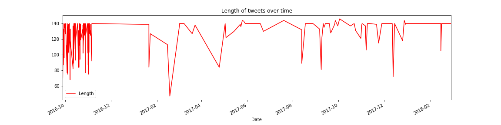
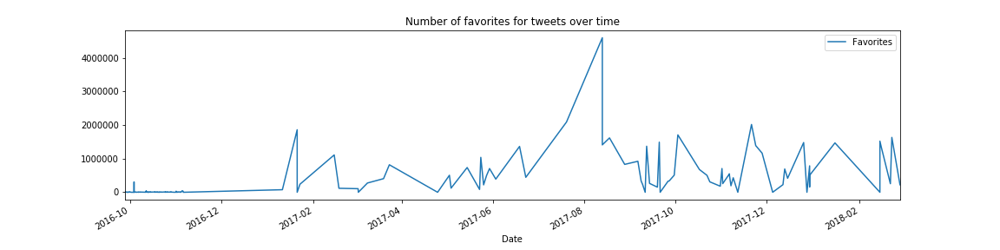
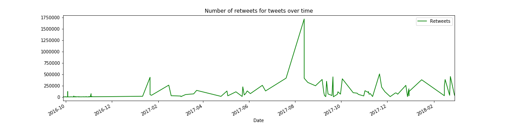
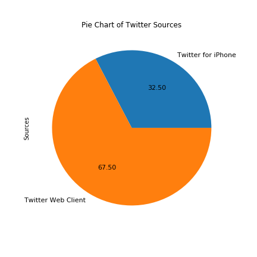

# TwitterAnalyzer

Visualizing statistics of a user's tweets utilizing packages such as Tweepy, pandas, matplotlib, and seaborn. Code was done in Jupyter Notebook. Sentiment analysis of a user's tweets.

Followed a guide as well as added extra functionality that interested me.

Some visualizations of data from @BarackObama.

**Length of Tweet VS Time**

**Number of Favorites VS Time**

**Number of Retweets VS Time**

**Twitter Sources Pie Chart**

Guide: https://dev.to/rodolfoferro/sentiment-analysis-on-trumpss-tweets-using-python-
